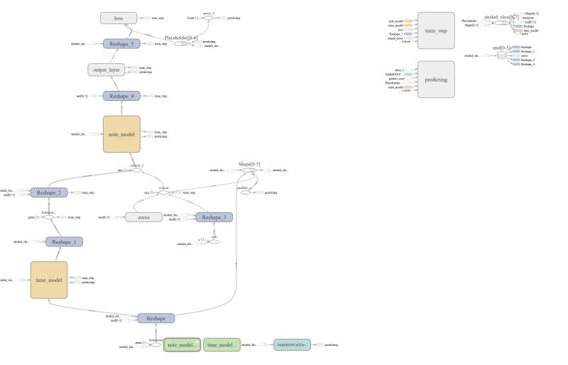

# ADS Project 5: Composing music with RNN

Term: Spring 2018

+ Team 5
+ Projec title: Compsing music with RNN
+ Team members:
	+ Yanjun Lin
	+ Yu Tong
	+ Xiuruo Yan
	+ Linna Yu
	+ Mingming Liu
	
+ Report：[ads_project5_group5.report](doc/main.pdf) 
+ Presentation Slides：[slides](doc/presentation.ppt)
+ Here is a `tensorboard` generated graph of our model:

+ Project summary: Music is a method that we can communicate with the other people. We express our happy, sad and anger. However, there are mathematical relationships behind it, like the octaves, keys and scales. Because of this precise relationship, we can use computer to generate music.
    In this project we implemented recurrent neural network to generate classical piano sonatas and pop music. The model, which uses LSTM layers and draws inspiration from convolutional neural networks, learns to predict which notes will be played at each time step of a musical piece. We built the model in TensorFlow deep learning framework and worte code in python. Here are the packages that required to run the model:
    
    **mido**, **bs4**, **lxml**, **tensorflow**, **urllib**.
    
    The main document is used to train the model. Here, you can use our pre-trained model or change arguments in the main file to train a new model. After training this model, we can use the predict part to predict new songs. 
    
    The useage of the following file in `lib` folder is listed below: 
    
    * `model_tb.py` is for the biaxial model class(with tensorboard).   
    
    * `data.py` is used to clean data for the model.  
    
    * `midi_scraper.py` is for scraping midi files. 
    
    * `midi_to_statematrix.py` is to read the midi files and translate it to notestate matrix. 
    
    * `operations.py` is for truning a nupy python function to a tensorflow operation. 
    
    * `cache.py` is used to save the input format of noet state matrix, which enables us train faster whithout translating data every time.
    * `main.py` is the main python script for training, it is intergrated with data download, cache initialization and training.
	
**Contribution statement**: ([default](doc/a_note_on_contributions.md)) All team members contributed equally in all stages of this project. All team members approve our work presented in this GitHub repository including this contributions statement. 

Following [suggestions](http://nicercode.github.io/blog/2013-04-05-projects/) by [RICH FITZJOHN](http://nicercode.github.io/about/#Team) (@richfitz). This folder is orgarnized as follows.

```
proj/
├── lib/
├── data/
├── doc/
├── figs/
└── output/
```

Please see each subfolder for a README file.
